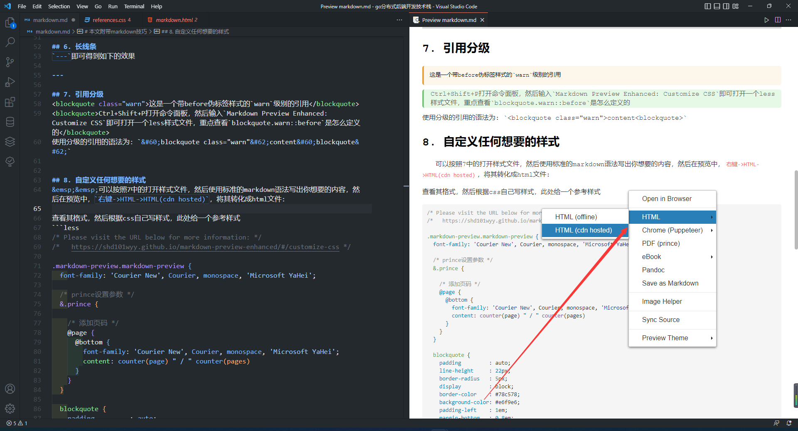
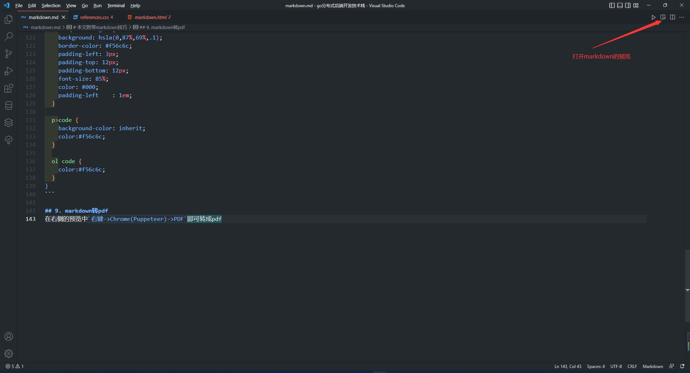
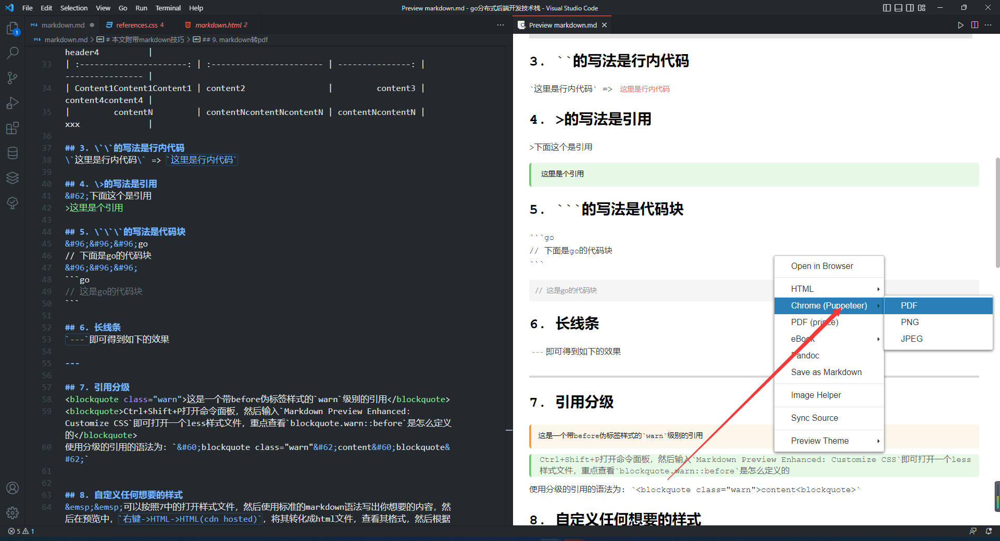
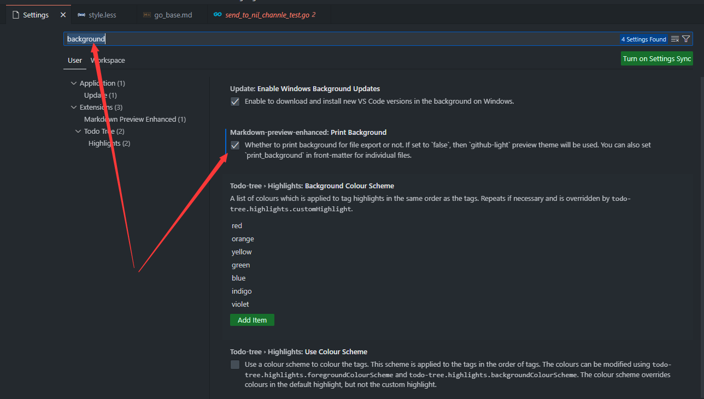
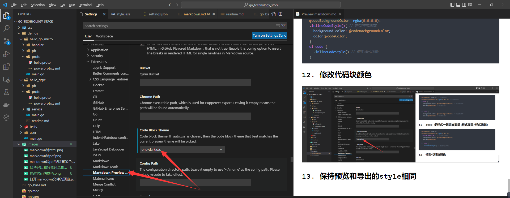
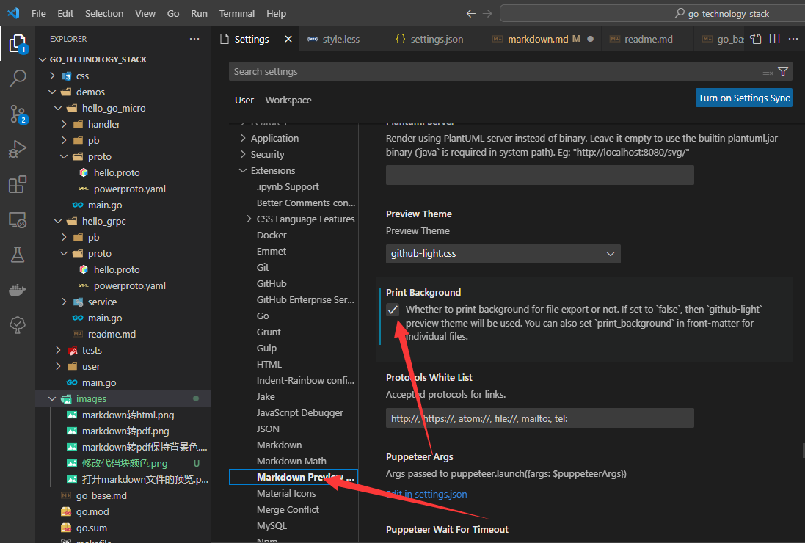
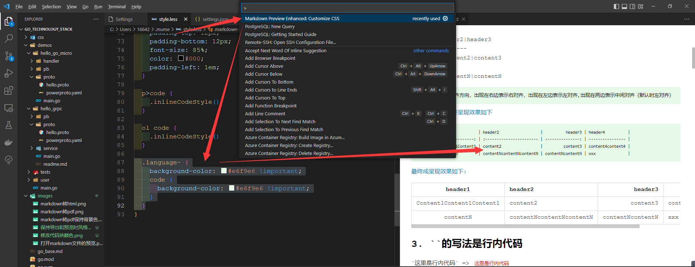

# 本文附带markdown技巧
## 0. 首先vscode上安装`Markdown Preview Enhanced`插件
此文档的很多技巧都是基于这个实现的
## 1. markdown页面内跳转
1. `[描述文字/目录标题](url#id)`
2. `<a id="table_example">这里可以有内容</a>`
3. 不写元素内容: 不需要显示内容时，可以直接不写元素内容，这样更便捷，也避免显示 不必要的文字。
4. 重点: 此处 元素的id属性值 和 上方表示链接的 #id 的id值相同，这是两个地方 关联在一起的方法。

最终效果: `1`处将会生成一个超链接，点击它将会跳转到`2`
>`id`可以自定义，但是`1`和`2`中的`id`应该是同一个值，并且最好唯一，
>如果是同页面跳转，`url`可以不写,假如指向同级目录下的另一个页面`readme.md`，则`1`中的`url`应该这么写: `./readme.md`

## 2. markdown表格
header1|header2|header3
\-\-\-\-|:----|:----
content1|content2|content3
...
contentN|contentN|contentN

>上面的`:`表示对齐方向，出现在右边表示右对齐，出现在左边表示左对齐,出现在两边表示中间对齐（默认时左对齐） 

下面的写法，[最终呈现效果如下](#table_example)
```
|         header1          | header2                  |          header3 | header4          |
| :----------------------: | :----------------------- | ---------------: | ---------------- |
| Content1Content1Content1 | content2                 |         content3 | content4content4 |
|         contentN         | contentNcontentNcontentN | contentNcontentN | xxx              |
```

<a id="table_example">最终成呈现效果如下:</a>

|         header1          | header2                  |          header3 | header4          |
| :----------------------: | :----------------------- | ---------------: | ---------------- |
| Content1Content1Content1 | content2                 |         content3 | content4content4 |
|         contentN         | contentNcontentNcontentN | contentNcontentN | xxx              |

## 3. \`\`的写法是行内代码
\`这里是行内代码\` => `这里是行内代码`

## 4. \>的写法是引用
&#62;下面这个是引用
>这里是个引用

## 5. \`\`\`的写法是代码块
&#96;&#96;&#96;go
// 下面是go的代码块
&#96;&#96;&#96;
```go
// 这是go的代码块
```

## 6. 长线条
`---`即可得到如下的效果

---

## 7. 引用分级
<blockquote class="warn">这是一个带before伪标签样式的`warn`级别的引用</blockquote>
<blockquote>Ctrl+Shift+P打开命令面板，然后输入`Markdown Preview Enhanced: Customize CSS`即可打开一个less样式文件，重点查看`blockquote.warn::before`是怎么定义的</blockquote>

使用分级的引用的语法为: `<blockquote class="warn">content</blockquote>`，其中warn就是下面[样式参考](#markdown-preview-enhanced-style)中的设置的


## 8. 自定义任何想要的样式
&emsp;&emsp;可以按照7中的打开样式文件，然后使用标准的markdown语法写出你想要的内容，然后在预览中，`右键->HTML->HTML(cdn hosted)`，将其转化成html文件:

查看其格式，然后根据css自己写样式，此处给一个参考样式

<a id="markdown-preview-enhanced-style"></a>

```less
/* Please visit the URL below for more information: */
/*   https://shd101wyy.github.io/markdown-preview-enhanced/#/customize-css */

.markdown-preview.markdown-preview {
  font-family: 'Courier New', Courier, monospace, 'Microsoft YaHei';

  /* prince设置参数 */
  &.prince {

    /* 添加页码 */
    @page {
      @bottom {
        font-family: 'Courier New', Courier, monospace, 'Microsoft YaHei';
        content: counter(page) " / " counter(pages)
      }
    }
  }

  blockquote {
    padding         : auto;
    line-height     : 22px;
    border-radius   : 5px;
    display         : block;
    border-color    : #78c578;
    background-color: #e6f9e6;
    padding-left    : 1em;
    margin-bottom   : 0.8em;
  }
  
  blockquote p {
    padding-left: 3px; 
    padding-top: 12px;
    padding-bottom: 12px;
    font-size: 85%;
    color: #000;
  }
  
  blockquote code {
    background-color: transparent;
    font-weight: bold;
    color:#f56c6c
  }
  
  blockquote.warn {
    background: rgba(230,162,60,.1);
    border-color: #e6a23c;
    padding-left: 3px; 
    padding-top: 12px;
    padding-bottom: 12px;
    font-size: 85%;
    color: #000;
    padding-left    : 1em;
  }
  
  blockquote.danger {
    background: hsla(0,87%,69%,.1);
    border-color: #f56c6c;
    padding-left: 3px; 
    padding-top: 12px;
    padding-bottom: 12px;
    font-size: 85%;
    color: #000;
    padding-left    : 1em;
  }

  p>code {
    background-color: inherit;
    color:#f56c6c;
  }
  
  ol code {
    color:#f56c6c;
  }
}
```

## 9. markdown转pdf
1. 打开markdown-preview-enhanced的markdown文件预览:

2. 在右侧的预览中`右键->Chrome(Puppeteer)->PDF`即可转成pdf


### 9.1 markdown转pdf后，失去背景色


## 10. less 颜色变量的定义和使用
```less
  @codeColor: #f56c6c; // 这里是定义
  @codeBackgroundColor: rgba(0,0,0,0); // 这里是定义
  p>code {
    background-color: @codeBackgroundColor; // 这里是使用
    color:@codeColor; // 这里是使用
  }
  
  ol code {
    background-color: @codeBackgroundColor; // 这里是使用
    color:@codeColor; // 这里是使用
  }
```

## 11. less 多样式一起定义变量(样式变量/样式函数)
```less
  @codeColor: #f56c6c;
  @codeBackgroundColor: rgba(0,0,0,0);
  .inlineCodeStyle(){ // 定义样式函数
    background-color: @codeBackgroundColor;
    color:@codeColor;
  }
  ol code {
    .inlineCodeStyle() // 使用样式函数
  }
```

## 12. 修改代码块颜色


## 13. 保持预览和导出的style相同


## 14. 修改普通代码块style(没有指定语言)
我们希望对于普通代码块(没有指定语言的那种)，其风格和语言代码块风格不同，因为我选的黑色背景不利于普通代码块的阅读，所以需要修改一下。
`Ctrl+Shift+P`，打开`Markdown Preview Enhanced: Customize CSS`，并增加如下代码，css配置成什么样的可以自己发挥。
下面的图三个箭头依次告诉你怎么打开这个文件，怎么修改，以及修改后的效果。
```less
  .language- {
    background-color: #e6f9e6 !important;
    code {
      background-color: #e6f9e6 !important;
    }
  }
```

